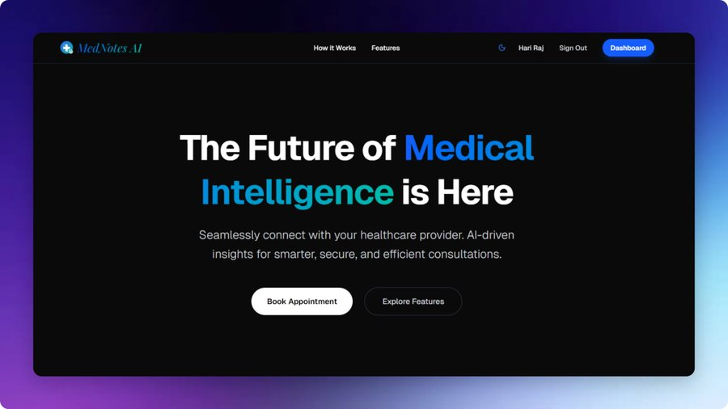

# MedNotes AI

We propose an AI-powered assistant to transform the healthcare patient journey in India. The process of booking appointments, sharing patient history, and handling follow-ups can be streamlined, reducing friction for both patients and doctors. Our solution is two-part: a pre-consultation voice agent for efficient patient intake, and a post-consultation assistant that logs and summarizes conversations, empowering both sides with instant, reliable information.

> **Demo Credentials**: You can find test user and doctor credentials in [docs/demo-creds.txt](docs/demo-creds.txt).

## Team : TypoBros

- Aditya Kumar Puri : [Github](https://github.com/puri-adityakumar)
- Chandra Shekhar Maurya : [Github](https://github.com/shekhar9837)

## Screenshots




## Prerequisites

- **Node.js**: Ensure you have Node.js (v18+) installed for the Next.js application.
- **Supabase Account**: You need a Supabase project for Authentication, Database, and Storage.
- **Kestra**: Used for orchestrating AI workflows (requires Docker).
- **API Keys**: Obtain the following keys:
  - **Gemini API Key**: For the booking and RAG agents.
  - **Groq API Key**: For fallback model inference.
  - **AssemblyAI API Key**: For audio transcription.
  - **OpenRouter API Key**: For consultation summaries and reports.

## Installation Steps

1.  **Clone the Repository**
    ```bash
    git clone https://github.com/puri-adityakumar/mednotes-ai.git
    cd mednotes-ai
    ```

2.  **Web Application Setup**
    Navigate to the app directory and install dependencies:
    ```bash
    cd app
    npm install
    ```

3.  **Environment Configuration**
    Create a `.env.local` file in the `app/` directory with the following credentials:
    ```env
    NEXT_PUBLIC_SUPABASE_URL="your-supabase-url"
    NEXT_PUBLIC_SUPABASE_ANON_KEY="your-supabase-anon-key"
    GOOGLE_GENERATIVE_AI_API_KEY="your-gemini-key"
    GROQ_API_KEY="your-groq-key"
    ASSEMBLYAI_API_KEY="your-assemblyai-key"
    OPENROUTER_API_KEY="your-openrouter-key"
    ```

4.  **Run the Application**
    Start the development server:
    ```bash
    npm run dev
    ```
    Open [http://localhost:3000](http://localhost:3000) to view the app.

5.  **Agent Workflow Setup (Kestra)**
    - Ensure Docker is running.
    - Start Kestra server.
    - Import the workflow files from the `agent/workflow/` directory (`ai_summary_workflow.yml`, `audio_transcription.yml`) into your Kestra instance.
    - Configure the necessary secrets and variables in Kestra.

## Important Note

Please refer to the [Documentation](docs/Documentation.md) for detailed information about the architecture, workflows, and prompts.

## Demo

[YouTube Demo](https://youtu.be/qlsUijWhC_k)
