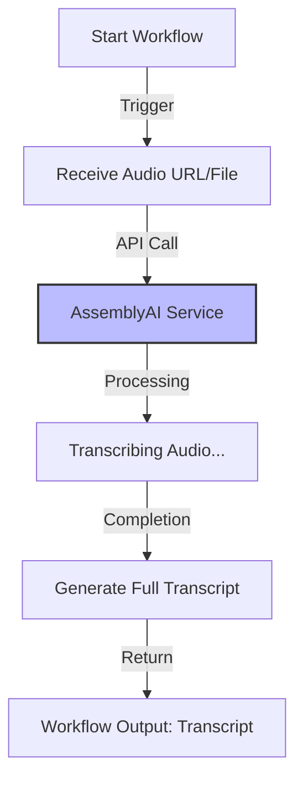

# Kestra Agent Workflows

This directory contains the Kestra workflow definitions used to orchestrate the AI agentic capabilities of MedNotes AI.

We currently have two main workflows automated via Kestra:

1.  **Audio Transcription Workflow** (`audio_transcription.yml`)
2.  **AI Summary & Report Workflow** (`ai_summary_workflow.yml`)

## 1. Audio Transcription Workflow

This workflow is responsible for taking the raw audio input (from the doctor-patient consultation) and converting it into a text transcript using AssemblyAI.



## 2. AI Summary & Report Workflow

Once the transcription is ready, this workflow processes the text to extract meaningful clinical insights, generate a summary, and structure a report for the doctor.

```mermaid
graph TD
    Start[Start Workflow] -->|Trigger| InputText[Receive Transcript]
    InputText -->|Prompt Engineering| LLM_Review[LLM Analysis (Amazon Nova 2 / Gemini)]
    LLM_Review -->|Task 1| Summary[Generate Consultation Summary]
    LLM_Review -->|Task 2| Structuring[Create Structured Clinical Report]
    LLM_Review -->|Task 3| ActionItems[Extract Prescriptions & Follow-ups]
    
    Summary --> Merge[Merge Outputs]
    Structuring --> Merge
    ActionItems --> Merge
    
    Merge -->|Finalize| Report[Final Clinical Report]
    Report -->|Save| Database[(Supabase Database)]
    
    style LLM_Review fill:#f9f,stroke:#333,stroke-width:2px
    style Database fill:#dfd,stroke:#333,stroke-width:2px
```

## Deployment

These workflows are deployed on a self-hosted Kestra instance running on an Azure VM via Docker.

### Running with Docker

To start the Kestra instance locally:

```bash
docker-compose up -d
```