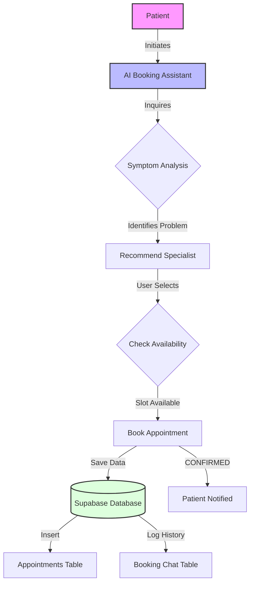
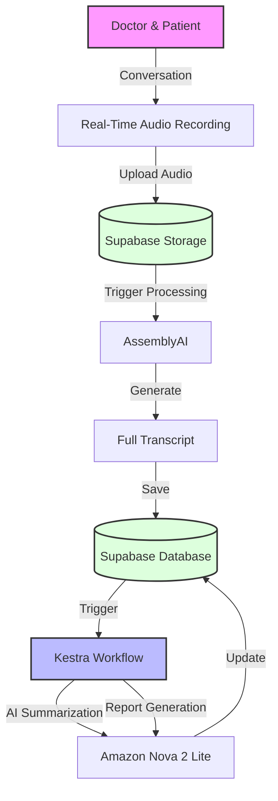
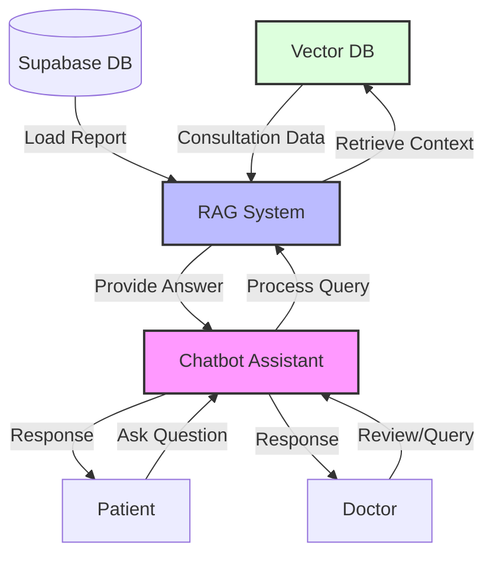

# Documentation: MedNotes AI

## Overview

We propose an AI-powered assistant to transform the healthcare patient journey in India. The process of booking appointments, sharing patient history, and handling follow-ups can be streamlined, reducing friction for both patients and doctors. Our solution is two-part: a pre-consultation voice agent for efficient patient intake, and a post-consultation assistant that logs and summarizes conversations, empowering both sides with instant, reliable information.

## Tech Stack

- **NextJS**: Frontend and backend
- **Supabase**: Auth, database, storage
- **AI SDK**: TypeScript library for building AI-powered applications
- **Kestra**: Workflow assistant (deployed on Azure VM)
- **Vercel**: Deployment platform
- **CodeRabbit**: Code review

### LLMs Used

| Feature/Component | Model | Provider |
|-------------------|-------|----------|
| **Audio Transcription** | AssemblyAI (Best-in-class Speech-to-Text) | AssemblyAI |
| **Consultation Summary & Report** | Amazon Nova 2 Lite | OpenRouter |
| **RAG Chat** (Patient & Doctor) | Gemini 2.5 Flash (Primary) <br> Llama 3.3 70b Versatile (Fallback) | Google Generative AI <br> Groq |
| **Booking Assistant** | Gemini 2.5 Flash (Primary) <br> Llama 3.3 70b Versatile (Fallback) | Google Generative AI <br> Groq |

## Pain Points

The healthcare journey in India continues to face several challenges:

1. **Incomplete Information**: Patients frequently forget crucial details about symptoms and medical history during visits, leading to incomplete information for diagnosis.
2. **Doctor Burnout**: Doctors spend significant time on manual documentation, which reduces direct patient engagement and contributes to burnout.
3. **Misinformation**: After consultations, patients often seek answers online, increasing the risk of misinformation and anxiety.
4. **Inefficient Retrieval**: Retrieving and referencing past records is inefficient, delaying continuity of care.

These issues create inefficiencies for doctors, confusion for patients, and ultimately impact healthcare outcomes.

## Proposed Solution

MedNotes AI introduces a three-phase workflow for improved clinical efficiency:

1.  **Pre-Consultation**: We transcribe initial patient calls to auto-schedule appointments and generate a preliminary report for the doctor.
2.  **Consultation**: Our platform records and transcribes the live dialogue, using AI to create structured clinical notes instantly while saving the conversation to a vector database.
3.  **Post-Consultation**: This data powers a Retrieval-Augmented Generation (RAG) chatbot. This allows doctors to instantly recall case details and enables patients to receive personalized, accurate answers to their follow-up questions, creating a seamless loop of information that reduces workload and enhances patient care.

### Workflow: Phase 1 - Pre-Consultation

Currently, patients interact via a chat interface to report symptoms and book appointments. A voice call integration is planned for the future to allow natural voice-based intake.



### Workflow: Phase 2 - Consultation

In this phase, the doctor-patient conversation is recorded, transcribed, and processed to generate clinical notes.



### Workflow: Phase 3 - Post-Consultation

Users can view the generated reports on the application. The system also enables an interactive chat where users can ask questions, and the AI RAG system retrieves context from the specific consultation report to differ personalized answers.



## Project Structure

```text
mednotes-ai/
├── app/                        # Main Next.js Application
│   ├── app/                    # App Router Pages & API Routes
│   │   ├── (dashboard)/        # Dashboard Pages (Doctor/Patient)
│   │   └── api/                # Backend API Endpoints (Chat, RAG, Booking)
│   ├── components/             # Reusable UI Components
│   │   ├── ai-elements/        # AI-Specific UI (Chat, Streaming)
│   │   ├── doctors/            # Doctor Dashboard Components
│   │   ├── patients/           # Patient Dashboard Components
│   │   └── ui/                 # Shadcn UI Components
│   └── lib/                    # Utilities & Helper Functions
│       ├── supabase/           # Supabase Client Configuration
│       └── utils.ts            # General Utility Functions
├── agent/                      # AI Agent Workflows
│   └── workflow/               # Kestra Workflow Definitions (.yml)
├── supabase/                   # Database Configuration
│   ├── migrations/             # SQL Migrations
│   └── scripts/                # Utility Scripts (e.g., Seed Data)
└── docs/                       # Project Documentation
```

## Future Scope

The project roadmap includes the following key expansions:

1.  **B2B SaaS Model**: Transitioning the platform to a SaaS model for clinics and hospitals to manage their patient data and AI workflows.
2.  **Voice Call System**: Implementing a real-time voice call/phone call system for the pre-consultation phase to automate appointment booking and symptom analysis without typing.
3.  **Live Transcription**: Enabling real-time, live transcription of patient-doctor conversations to display text as it is spoken, rather than processing it after the recording stops.
4.  **Personalized Health Agent**: Developing a personalized AI agent that tracks individual patient health metrics and concerns over time, offering proactive advice.
